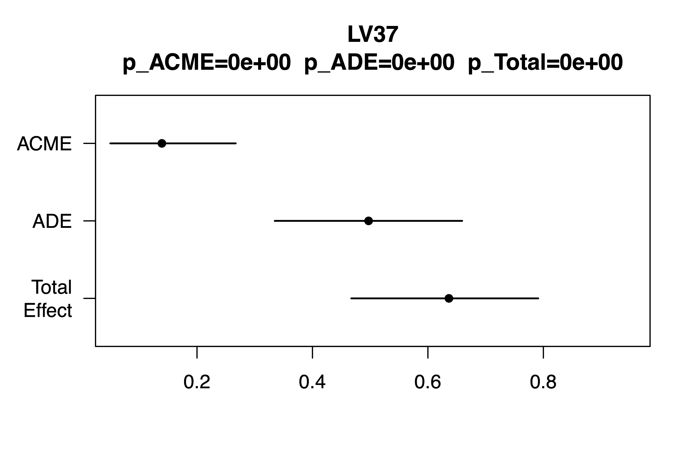
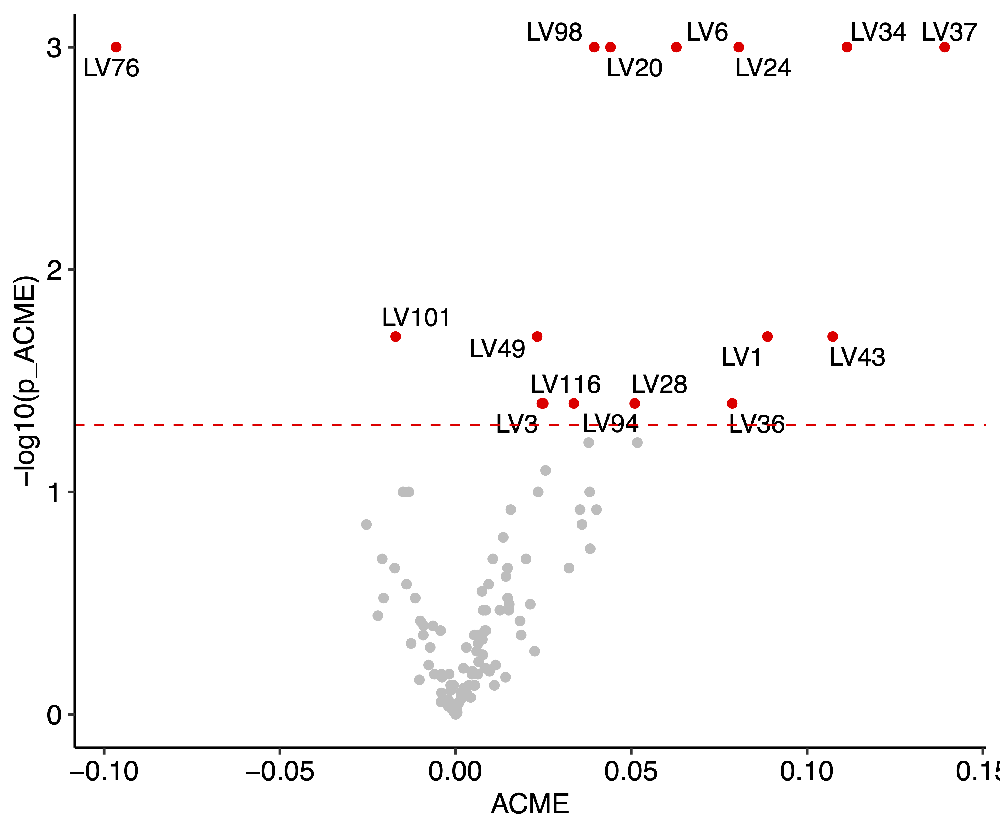
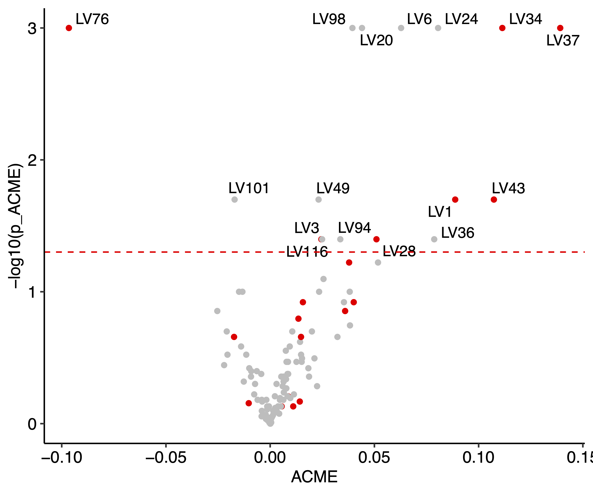
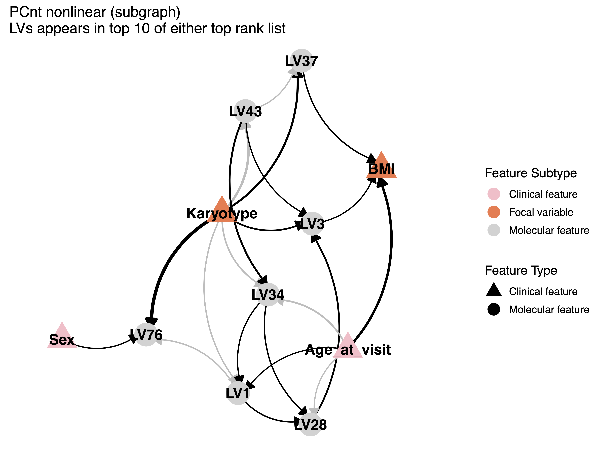

# Causal analysis on HTP data
## Step 1. Data input and pre-processing
#### 1.1. Input
```r
library(bioCausal) # https://github.com/zhu-yh1/bioCausal
data = read.table("htp_plier_model_k0.75_frac1.csv.tsv", sep="\t", row.names = 1, header = T)
metadata = read.table("master_htp_tpm_t21_d21_w_ds_co_occu.clinical.tsv", sep="\t", row.names = 1, header = T)
```
```r
dim(metadata)
# [1] 399  24
dim(data)
# [1] 400 117
sum(metadata$LabID %in% rownames(data))
# [1] 399
data = data[match(metadata$LabID, rownames(data)),]
```
#### 1.2. Batch correction and data scaling
```r
library(sva)
library(ggpubr)
dataCN=ComBat(t(data), metadata$Sample_source)
dataCN_tscaled = tscale(dataCN)
# used batch corrected data
data = dataCN_tscaled
# rename data
LV_table = data.frame("LV" = paste0("LV", 1:117), "Pathway" = sub(".*?\\.", "", rownames(data)))
rownames(data) = LV_table$LV
```

#### 1.3. Missing data imputation and metadata scaling
```r
# impute BMI
tmp = rbind(data, metadata$BMI)
library(impute)
knnRes = impute.knn(t(tmp))
metadata$imputed_BMI = knnRes$data[,118]

# we should scale BMI and age
BMI_scaled = as.numeric(metadata$imputed_BMI)
s = sd(BMI_scaled)
m = mean(BMI_scaled)
BMI_scaled = (BMI_scaled-m)/s

Age_scaled = as.numeric(metadata$Age_at_visit)
s = sd(Age_scaled)
m = mean(Age_scaled)
Age_scaled = (Age_scaled-m)/s
```
## Step 2. Causal mediation analysis
#### 2.1. Test mediation effect with linear outcome and mediator models
```r
# install.packages("mediation")
library(mediation)

# test each LV, save results in res and save summary plots
# ACME stands for average causal mediation effects of A on B mediated through C
# ADE stands for average direct effects of A on B
# Total effect stands for the total effects (direct and indirect) of A on B
res = c()
for (i in 1:117) {
  print(i)
  df=data.frame(BMI=BMI_scaled, Karyotype=metadata$Karyotype=="T21", 
                Sex=metadata$Sex=="Male",
                Age = Age_scaled, lv = data[paste0("LV", i),])
  
  med.fit=lm(lv~1+Karyotype+Age+Sex, data=df)
  out.fit=lm(BMI~1+Karyotype+Age+Sex+lv, data=df)
  set.seed(i)
  med.out=mediate(med.fit, out.fit, treat="Karyotype", mediator="lv", robustSE = T, sims = 100, parallel = "multicore")
  summary(med.out)
  res = rbind(res, c("ACME" = med.out$d.avg, "p_ACME" = med.out$d.avg.p, "ADE" = med.out$z.avg, "p_ADE" = med.out$z.avg.p, "Total" = med.out$tau.coef, "p_Total" = med.out$tau.p))
  plot(med.out) + title(paste0("LV", i, "\np_ACME=", format(med.out$d.avg.p, scientific=T),
                               "  p_ADE=", format(med.out$z.avg.p, scientific=T),
                               "  p_Total=", format(med.out$tau.p, scientific=T)))
}
```
> Eample of LV37 mediation effect
> 

#### 2.2. Plot mediation test summary
```r
library(ggrepel)
rownames(res) = paste0("LV", 1:117)
res=data.frame(res)
# this is for better visualization of p-value
res[res==0] = 1e-3
# plot mediation test results in volcano plot
ggplot(res, aes(y=-log10(p_ACME), x=ACME)) + geom_point(color=ifelse(-log10(res$p_ACME)>=-log10(0.05), "red", "grey")) +
  geom_text_repel(aes(label=ifelse(-log10(res$p_ACME)>=-log10(0.05), rownames(res), ""))) + theme_pubr() +
  # geom_vline(xintercept = c(-0.05, 0.05), linetype="dashed") +
  geom_hline(yintercept = -log10(0.05), linetype="dashed", color="red")

# mediating LVs are those with p_ACME<0.05
mediateLV = rownames(res)[res$p_ACME<0.05]
```
> mediating LVs are colored in red
> 

#### 2.3. Select intersecting LVs from Karyotype and BMI elastic net regression model
```r
# sort based on absolute value of coefficient
TopKaryolist = read.table("Karyotype_feature_w_ela_net.csv", sep=",", header=T)
rownames(TopKaryolist) = paste0("LV", sub(",.*", "", TopKaryolist$feature_name))
TopKaryolist$LV = rownames(TopKaryolist)
TopKaryolist = TopKaryolist[order(abs(TopKaryolist$feat_w_ela_net_coeff), decreasing=T),]

TopBMIlist = read.table("BMI_feature_w_ela_net.csv", sep=",", header=T)
rownames(TopBMIlist) = paste0("LV", sub(",.*", "", TopBMIlist$feature_name))
TopBMIlist$LV = rownames(TopBMIlist)
TopBMIlist = TopBMIlist[order(abs(TopBMIlist$feat_w_ela_net_coeff), decreasing=T),]

# select top 10 LVs from each elastic net model
toplist = unique(c(TopKaryolist$LV[1:10], TopBMIlist$LV[1:10]))
# select intersecting LVs for causal discovery
selectedLV = intersect(toplist, mediateLV)

# plot selection result
ggplot(res, aes(y=-log10(p_ACME), x=ACME)) + geom_point(color=ifelse(rownames(res)%in%toplist, "red", "grey")) +
  geom_text_repel(aes(label=ifelse(-log10(res$p_ACME)>=-log10(0.05), rownames(res), ""))) + theme_pubr() +
  geom_hline(yintercept = -log10(0.05), linetype="dashed", color="red")
```
> selected LVs are colored in red
> 

## Step 3. Causal discovery
#### 3.1. Set mediating LVs and clinical features as input
```r
selected = mediateLV
input_all = rbind(data[mediateLV,],
              "BMI" = BMI_scaled,
              "Karyotype" = metadata$Karyotype=="T21",
              "Sex" = metadata$Sex=="Male",
              "Age_at_visit" = Age_scaled)
```

#### 3.2. Sample bootstrapping
```r
n = length(selected)
nrep=20
for (i in 1:nrep) {
  set.seed(i)
  subsample = sample(colnames(input_all), replace = T)
  subi = t(input_all[,subsample])
  rownames(subi) = make.names(rownames(subi), unique = T)
  write.table(subi, file.path("T21_mediation/bootstrapInput_v2", paste0("input", i, ".tsv")), sep="\t", quote=F)
}
```
#### 3.3. A hybrid constrained optimization-based method for causal discovry (PCnt)
3.3.1. PC with edge constraints (Python implementation)
> We used causal-learn for a PC implementation with background knowledge constraints
> Karyotype, Age_at_visit and Sex should not have causal regulators
> We selected a nonlinear kernel (kci) for conditional independent test for PC algorithm
```python
import causallearn
import numpy as np
import pandas as pd
from causallearn.utils.PCUtils.BackgroundKnowledge import BackgroundKnowledge
from causallearn.search.ConstraintBased.PC import pc

for subgID in range(1, 21):
    df = pd.read_csv("T21_mediation/bootstrapInput_v2/input"+str(subgID)+".tsv", sep="\t")
    bgk_sample = BackgroundKnowledge()
    column_names = df.columns

    for node_1 in ["Karyotype", "Age_at_visit", "Sex"]:
        for node_2 in column_names.tolist():
            bgk_sample.add_forbidden_by_pattern(node_pattern1=node_1, node_pattern2=node_2)

    data = df.values

    cg = pc(data, alpha=0.01, indep_test="kci", background_knowledge=bgk_sample, node_names=column_names.tolist())

    graph_output = cg.G.graph
    output = np.zeros_like(graph_output)

    n_x, n_y = graph_output.shape
    for i in range(n_x):
        for j in range(n_y):
            if (graph_output[i,j] == 1) and (graph_output[j,i] == -1):
                output[i,j]=1
            elif (graph_output[i,j] * graph_output[j,i] > 0):
                output[i,j]=1
                output[j,i]=1
            elif (graph_output[i,j] + graph_output[j,i] != 0):
                print("nonsymettric")

    ans = pd.DataFrame(output, columns = df.columns, index = df.columns)
    ans.to_csv("T21_mediation/PCkci_v2/pcOut"+str(subgID)+".tsv", sep="\t")
```

3.3.2 NOTEARS using PC output as constraints (R implementation in PCnt)
```r
library(PCnt) # devtools::install_github("zhu-yh1/PC-NOTEARS/PCnt")

# set initial value to 0
pcnlntres = matrix(0, ncol=nrow(input_all), nrow=nrow(input_all))
rownames(pcnlntres) = rownames(input_all)
colnames(pcnlntres) = rownames(input_all)

# for each PC output run notears
for (i in 1:nrep) {
  input = read.table(file.path("T21_mediation/bootstrapInput_v2", paste0("input", i, ".tsv")), sep="\t")
  tmp = read.table(file.path("T21_mediation/PCkci_v2", paste0("pcOut", i, ".tsv")), sep="\t", header=T, row.names = 1)
  no_edge = !tmp
  nttmp = notearsInterceptMultiLoss(as.matrix(input), lambda1=0.01, no_edge = no_edge)
  pcnlntres = pcnlntres + nttmp$graph
}

# take average across bootstrapping outputs
pcnlntres = pcnlntres/nrep
# enforce a dag constraint
pcnlntres_dag = adj2dag(pcnlntres, topE=250)
```
#### 3.4 Visualization of causal discovery output
3.4.1. Keep intersecting LVs
```r
keep = c(match(selectedLV, rownames(input_all)), 17:20)
```
3.4.2. Set variable group
```r
gvarType = c(rep("Molecular feature", n), rep("Clinical feature", 4))
gvarShape = c(rep("Molecular feature", n), rep("Clinical feature", 4))
# set Karyotype and BMI as focal variable
gvarShape[c(n+1, n+2)] = "Focal variable"
```
3.4.3. Visualization
```r
pnt = bioCausal::network_visualize(pcnlntres_dag[keep,keep], gvarType = gvarShape[keep], gvarShape = gvarType[keep], seed=1, topE=50)
pnt$p  +
  scale_color_manual(values = c("Molecular feature" = "lightgray", "Clinical feature" = "pink", "Focal variable" = "coral")) +
  scale_shape_manual(values = c("Molecular feature" = 19, "Clinical feature" = 17)) +
  ggtitle("PCnt nonlinear (subgraph) \nLVs appears in top 15 of either top rank list")
```
> 